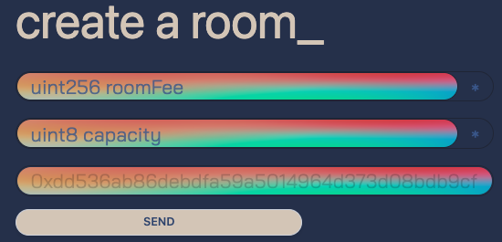
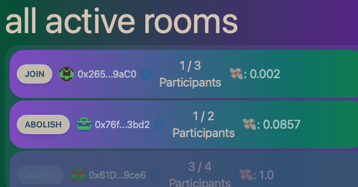

# 🎲 HalalGamble 🎲

HalalGamble is a gambling dApp template that employs a commit-reveal scheme to offload the randomness to the participants, eventually constructing a random number based on numbers submitted by the end users, which in turn yield a winner to be paid.

 

Requirements

Before you begin, you need to install the following tools:

- [Node (v18 LTS)](https://nodejs.org/en/download/)
- Yarn ([v1](https://classic.yarnpkg.com/en/docs/install/) or [v2+](https://yarnpkg.com/getting-started/install))
- [Git](https://git-scm.com/downloads)

# Motivation

Commit-reveal comes as an important solution for generating randomness on-chain, as blockchains are meant to be deterministic. Random number generation must be offloaded to oracles or a live network of randomness providers.

In cases like interactive, especially luck-based games, we usualy have a live cohort of users waiting for a resolution, maybe to see who the winner will be. This kind of scenarios enable offloading the randomness generation responsibility to the participants directly, and this is what HalalGamble demonstrates.

# How it works & How to interact

## What's a room and how to create one

HalalGamble works with game rooms, and anyone can create a game room if they pay the entrance fee, which is again defined by the room creator. Room creation requires 2 inputs: <u>roomFee</u> and <u>capacity</u>. Capacity denotes the number of intended players, and a room can only go live when the capacity is entirely fulfilled. Anyone joining the room must pay the <u>roomFee</u> specified here, and the big prize of this room will exactly be <u>roomFee \* capacity</u>.

The hash at the bottom is your cryptographic commitment to the potential room you'll be creating by pressing the send button. It's automatically generated based on the connected account address and an automatically generated and stored random number.

It's easy to see why the commitment contains a random number, but why does the commitment contain the user address? Because other people can join to your room with your hash, effectively replaying your commitment. This user can then wait for your reveal and then reveal the same number themselves.

After the room is created, you're waiting for other people to pay the entrance fee and join. People must generate a random number and bake the same kind of commitment you did while creating the room.

## Joining a room

Rooms awaiting participants AND rooms being played live are displayed under 'all active rooms' section. Rooms are listed here as the front-end is subscribed to the room creation events that we define on-chain.

Users can join existing rooms if there's available capacity, or abolish the rooms they created before the gambling begins. The latter would perform a refund to awaiting participants and finish the game there.

When a user joins a room, a random number is generated, written to local storage; then this number is packed with user address, and hashed. This is exactly the same process that happens with creating a room.

## Interacting with a live room

The game goes live when a room's capacity is saturated. There are N people in the room and they all generated their randomness and made their commitments at this point.

We see static room details at the top, and dynamic information in the middle. This view gets updated as more people interact with the room, via chain events coming from the contract.

### Valid and Invalid Reveals

A valid reveal is when a participant reveals their random number correctly. If this sentence doesn't tick, look at the bottom left of the screenshot. That is the random number the front-end javascript created for the given participant. As this number is not managed by an on-chain logic or storage, the user has the full responsibility to provide the same random number they used to bake the initial commitment to join the room. HalalGamble comes with HalalFrontEnd which performs this operation automatically for you, but what if you remove that random number from your browser's local storage o.O ?!?

HalalGamble forfeits invalid reveals, so their money will be granted to the winner. This is because the participant failed to fulfill their responsibility of providing randomness to the game. So what happens if nobody provides a valid reveal? HalalGamble refunds the room fee to the participants. No harm done.

HalalGamble holds an <u>xor accumulator</u> per room, getting xor'ed with every random number coming from valid reveals. As participants keep revealing their numbers, the xor tick gets updated. This xor operation could well be done at once after the revealing phase completely ends, but then think about a case where a room contains a big number of participants: the EOA making the final call iterating over all reveals and accumulating the XOR would pay a lot of gas fees. Performing accumulations on-the-fly is a more scalable option then having one final trigger that performs a big for loop.

Valid reveals emit chain events, which are heard by the front end to update the displayed xor value. That display is there to emphasize the fact that on-chain randomness that we accumulate from users <u>up to a given time</u> is totally simulatable off-chain. Another thing the xor display is emphasizing is <u>if no more valid reveals come after this point, the winner will be the displayed participant</u>. This is consistent with what we have been discussing so far: we can only rely on valid reveals to generate randomness, and punish the invalid revealers to discourage this behavior. At any time we know who made the valid reveals, so we can pre-determine who the winner will be if the game ends with given status quo.

### Determining the winner

Invalid revealers fail to provide randomness, and their submissions are not considered when determining the winner. Winner determination can only happen <u>after everyone submits their reveals</u>, because we don't know what the eventual number will be until everyone reveals theirs.

We have an xor value accumulated from valid reveals in the end, and this xor value is our random number. You can now take this random number and build an ending mechanism with it: will you determine one single winner, will you determine 3 winners, will multiple winners get the same reward, etc. HalalGamble performs a traditional modulo operation over the valid revelers to come up with the winning index.

The xor operation is also <u>order independent</u>, which is a good thing as miners can manipulate the transaction orders. Nature of xor operation disables these kinds of attacks.

### What if a participant doesn't reveal?

HalalGamble defines a time period of 3 minutes (configurable), and whenever a participant makes a reveal, it sets a <u>reveal expiry date</u> which is reveal time + 3 minutes. This expiry date is NOT set until the first reveal comes, and it gets updated with each incoming reveal.

If after waiting a long time nobody continues to make reveals, anyone can call the **triggerRevealExpiry** function to distribute the reward to the current winner. If a participant refreshes the page 3 minutes after the last reveal, they'll see a <u>FINISH GAME</u> button, which will perform this action. This effort is a guard against lazy participants that don't want to reveal their numbers, preventing the valid revealers to get their earnings.

Of course this introduces a sensitive dynamic and the 3 minute time period must be adjusted very carefully to the needs of the gambling platform.

## Is this approach viable?

Although we enforce the participants to pay a fee at the entrance, we cannot entirely prevent consensus among participants: they can talk to each other, reveal their numbers to each other, and act together.

Consider the screenshot in the live room example. We have 4 participants, 2 have made valid reveals, and 2 are pending. There's no way to stop the current winner to <u>offer pending revealers to split the winnings</u>, so they don't make a reveal, and eventually the reveal expiry trigger is run. If there wasn't an expiry trigger, the money would be locked up there, or maybe you could employ a refund mechanism after a long period.

Normally in lottery-like scenarios you have days or even weeks of commit and reveal phases, and huge number of participants; so reveal expiry isn't really a problem. But HalalGamble tries to demonstrate a short-term small-sized gambling scenario so reveal expiry is a problem.

🤪 🤪 Or you can create a room for 1000, join with 999 of your accounts, and wait for a prey 🤪 🤪 For this not to happen we need to have on-chain identity infrastructure installed (via Chainlink or sth). HalalGamble does not come with such an integration so the users carry the responsibility of not joining rooms that they don't trust :)
